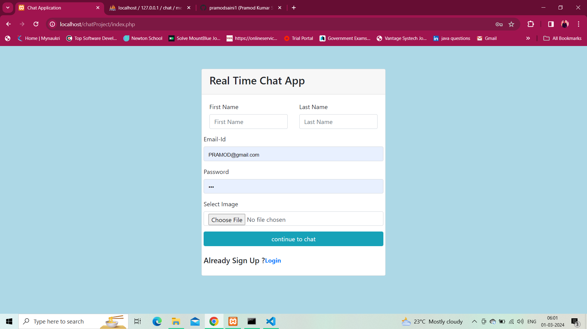
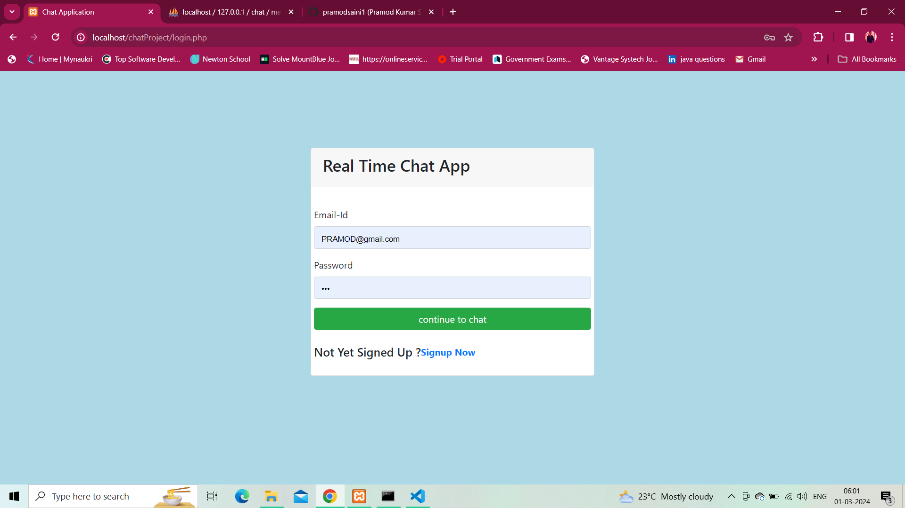
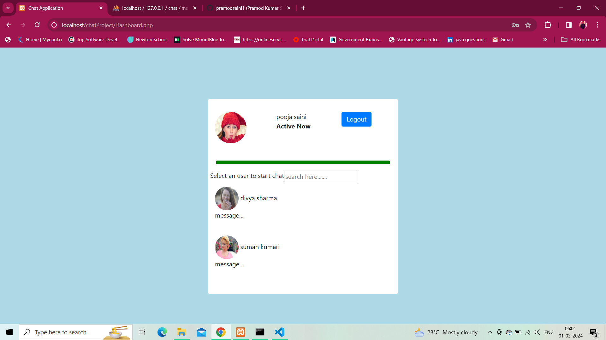
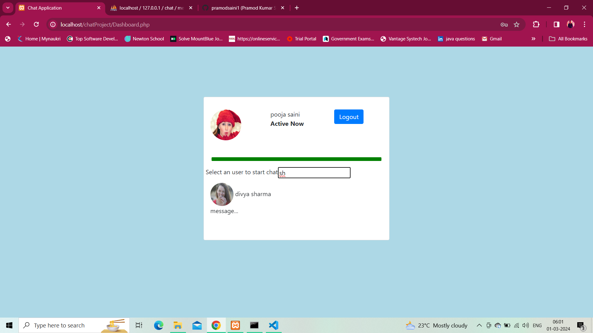
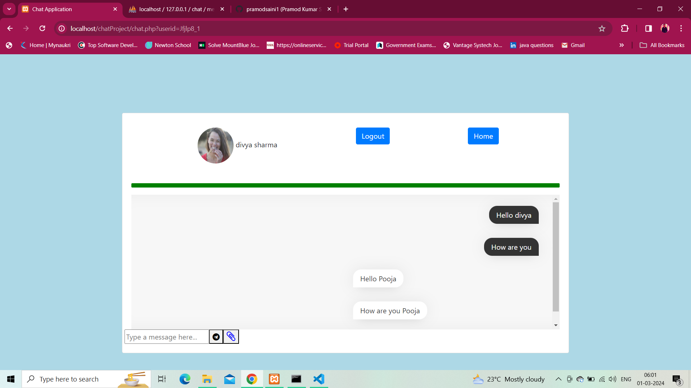
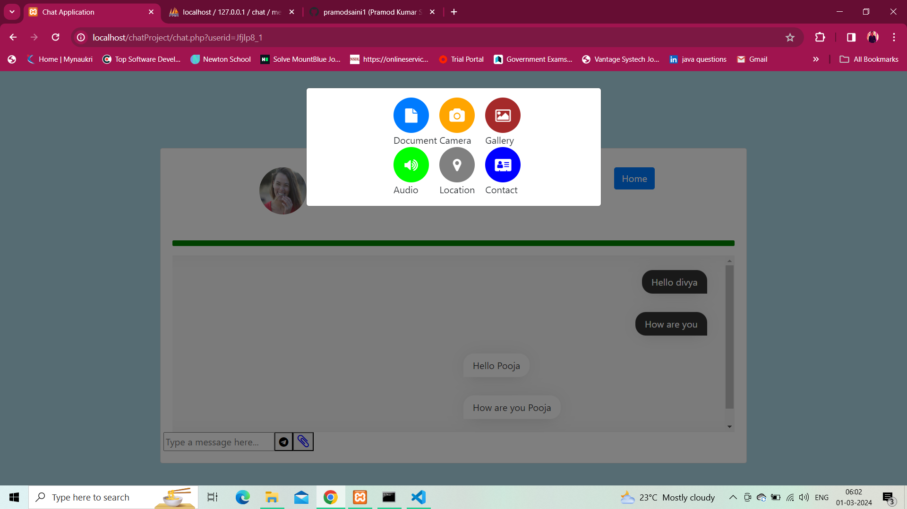

## Real Time Chat Application

## Technology ---HTML,CSS,JAVASCRIPT,JQUERY,AJAX,MYSQL,PHP

# Developed a real-time chat application using PHP and JavaScript to facilitate instant communication between users.

# Managed server-side logic for handling user interactions, message persistence, and security measures.

# Demonstrated ability to work independently and collaboratively to deliver a high-quality, functional application.

## Registration Page

## Login Page

## Dashboard Page
 

## Search Page

## chat Page

## multi-media Page

